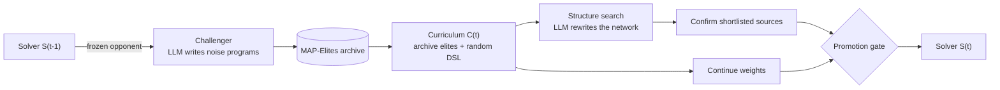

# DuoEvo

**Challenger–Solver co-evolution for noise-robust bearing fault diagnosis.**

DuoEvo couples two LLM-driven program searches. The **Challenger** writes noise-generator
programs that are hard for the current classifier; the **Solver** trains on the resulting
curriculum and, when a promotion gate allows it, rewrites its own network structure. Every round
follows `S(t-1) → C(t) → S(t)`, and the classifier is finally tested on held-out noise families
that the Challenger's language cannot express.



## Repository layout

```
duoevo.py              co-evolution driver: round loop, curriculum, training, gate, CLI
challenger.py          Challenger branch: frozen opponent, OpenEvolve search, archive re-scoring
lineage.py             structure-search lineage: parent sampling and quality rollback
resume.py              crash-safe progress for --resume
coevolve_bearing/      datasets, noise DSL, curriculum augmentation, metrics, T2 test
evolve/                programs and evaluators run by the searches
  seed_solver.py         Solver seed: the published ClassBD network as an evolvable program
  seed_generator.py      Challenger seed program
  evaluator_*.py         contracts and scoring for both branches
  noise_lib.py           noise primitives available to Challenger programs
  solver_lib.py          building blocks available to Solver programs
baselines/             static backbones and ClassBD + MART-LOAT under a shared recipe
configs/               base.yaml (shared protocol), pu / cwru / jnu / smoke, llm/
tests/                 unit tests
```

## Setup

Python 3.10 with a CUDA build of PyTorch 2.7:

```bash
pip install -r requirements.txt
```

**Data.** Place the three datasets under `data/` (or edit `root` in the dataset configs):

| Dataset | Expected layout | Classes | Train / dev / test windows |
| --- | --- | --- | --- |
| PU (Paderborn University) | `data/PU/K001/N15_M07_F10_K001_1.mat`, ... | 3 | 39,017 / 4,882 / 4,877 |
| CWRU (Case Western Reserve) | `data/CWRU/12k Drive End Bearing Fault Data/*.mat`, `data/CWRU/Normal Baseline Data/*.mat` | 10 | 3,436 / 1,112 / 1,132 |
| JNU (Jiangnan University) | `data/JNU/n600_3_2.csv`, `ib600_2.csv`, ... | 4 | 3,342 / 1,056 / 1,062 |

All signals are resampled to 12 kHz and cut into 2048-sample windows. A held-out operating
condition (PU `N09_M07_F10`, CWRU load 3, JNU 1000 rpm) is never used.

**LLM endpoint.** Both searches call an OpenAI-compatible chat API (GLM-5.2 by default):

```bash
export OPENEVOLVE_API_KEY=...        # api_base and model: configs/llm/*.yaml
```

## Running

```bash
# All four arms of one dataset and seed, in order (the paper uses seeds 11, 23, 37)
python duoevo.py run --config configs/cwru.yaml --seed 11

# Continue after an interruption
python duoevo.py run --config configs/cwru.yaml --seed 11 --resume

# Score every saved checkpoint on T2 once all arms have finished
python duoevo.py evaluate --config configs/cwru.yaml --seed 11

# Wiring check on a small CWRU subset (still calls the LLM a few times)
python duoevo.py run --config configs/smoke.yaml --arms DuoEvo
```

Outputs go to `runs/<dataset>_s<seed>/<arm>/`: `round_log.json` (every decision of every round),
`roundN/champion.pt` (deployed checkpoint), `roundN/curriculum/` and the search lineages.
`evaluate` writes `t2_eval.json` and `t2_summary.json`.

### Arms

| Arm | Structure | Curriculum |
| --- | --- | --- |
| `DuoEvo` | searched until 3 consecutive non-promoting searches or 8 searches | evolved by its own Challenger |
| `Evolve-NoStruct` | frozen at the ClassBD anchor | evolved by its own Challenger |
| `Replay-Anchor` | frozen at the ClassBD anchor | DuoEvo's curricula, byte for byte |
| `Random-Noise` | frozen at the ClassBD anchor | random DSL programs, no Challenger |

### Protocol

One protocol, defined in `configs/base.yaml`, is used for every dataset; the dataset configs only
describe the data.

- **Rounds.** 20 macro rounds. Each deployed checkpoint accumulates 8 epochs on C(0) and 32 per
  round, 648 epochs in total, whether or not a structure is ever promoted.
- **Challenger.** 16 programs per round, scored against the frozen Solver at −4 dB by the negative
  classification margin; the whole archive is re-scored against every new opponent.
- **Curriculum.** 35% extra noisy windows at 0 / −3 / −6 dB, half from at most 8 archive elites and
  half from random DSL programs. Checkpoints are selected on dev windows carrying the same noise.
- **Structure search.** 40 LLM rewrites per search round, screened for 8 epochs; the incumbent,
  the best screen and the best of another descriptor cell are retrained from scratch for 104
  epochs on the same curriculum and seed.
- **Promotion gate.** Five canonical noise families on dev, at SNRs and seeds used nowhere else.
  A mutation is promoted if its mean beats the incumbent source by δ = 0.0283 and its clean, two-
  worst-family and per-family scores stay within 0.01 / 0.0845 / 0.03. The winner is rebuilt over
  C(0..t) at the accumulated budget and deployed only if it scores at least as well as the running
  checkpoint. The
  thresholds come from `python duoevo.py calibrate` (δ = 2σ, ε_worst = 3σ over repeated trainings).
- **Switch audit.** When the structural branch closes, the deployed structure is compared with
  the anchor on the current curriculum and rolled back if it no longer holds up.
- **T2 test.** Four noise families outside the Challenger DSL (swept chirp, multiplicative speckle,
  heavy-tailed bursts, their mixture) at 0 / −3 / −6 dB on the test split. T2 is never read during
  `run`.

## Baselines

Static backbones and ClassBD + MART-LOAT use the same C(0) curriculum, a shared class-weighted
cross-entropy recipe with an architecture-independent batch order, the same 648-epoch budget and
the same T2 test.

```bash
python -m baselines.run_table --datasets pu,cwru,jnu --seeds 11,23,37
python -m baselines.run_mart_loat --datasets pu,cwru,jnu --seeds 11,23,37 --evaluate
```

The upstream implementations are not redistributed. Clone them into `third_party/`:

| Directory | Model | Source |
| --- | --- | --- |
| `third_party/ClassBD` | ClassBD-BDWDCNN | [Liao et al., MSSP 2025](https://www.sciencedirect.com/science/article/pii/S0888327024006484) |
| `third_party/Qttention` | QCNN, WDCNN | [Liao et al., IEEE TIM 2023](https://ieeexplore.ieee.org/abstract/document/10076833) |
| `third_party/TFN` | TFN-STTF | [Chen et al., MSSP 2024](https://www.sciencedirect.com/science/article/pii/S0888327023008609) |
| `third_party/DRSN` | DRSN-CW (`DRSN-CW.py`) | Zhao et al., IEEE TII 2020 |
| `third_party/GTFENet` | GTFENet | [liguge/GTFENet_pytorch](https://github.com/liguge/GTFENet_pytorch) |

`python -m baselines.adapters` checks that every adapter builds and returns raw logits.

## Tests

```bash
python -m pytest tests
```

The tests cover the promotion gate, the structure router, curriculum materialization and
replay, the accumulated-schedule rebuild, data splits, resume checks, the seed-program contracts
and the baseline recipe.
